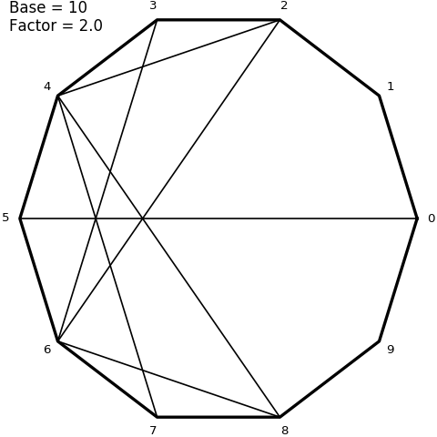

# Multiplication curves

This repository contains elements to represent a
[multiplication table](https://en.wikipedia.org/wiki/Multiplication_table)
on a circle. More precisely, the result of a multiplication table is plotted
against the modulo operation of the basis.

Given a [base (or a radix)](https://en.wikipedia.org/wiki/Radix) `b`, a circle is created
and is equally divided with respect to the chosen base `b`.
Then, given a factor `f`, we evaluate `f * [0, 1, 2, ..., b[ % b`, where `%`
represents [modulo operation](https://en.wikipedia.org/wiki/Modulo_operation).
For each number `n` in `[0, 1, 2, ..., b[`, a line is plotted between this number on the circle
and the associated point `f * n % b`.

As the base grows, the figure presents nice patterns.

Here is the representation of table 2 with decimal base.

Here is the representation of table 2 with base 360.

Here is an animation that shows the evolution of these circles when factor goes from 2 to 4.

Here are some command line examples that can be used to create images

    # Display help
    python multiplication.py -h

    # Create a single simple image with default parameters
    python multiplication.py -o test.png

    # Create a single simple image with factor 9 and base 360
    python multiplication.py -b 360 -f 9 -o test.png

    # Create a movie with 21 frames where factor goes from 2 to 3 on a 360 basis with text. Parallelism is used
    python multiplication.py -t -b 360 -f 2--3 -n 21 -p -o mult.mp4

    # Same as previous but with fully developped argument
    python multiplication.py --text --base 360 --factor 2--3 --number 21 --parallel --output mult.mp4
